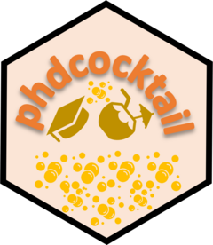

<!-- README.md is generated from README.Rmd. Please edit that file -->

# phdcocktail <a href="https://dahhamalsoud.github.io/phdcocktail/"></a>

<!-- badges: start -->
<!-- badges: end -->

[phdcocktail](https://dahhamalsoud.github.io/phdcocktail) is a toolkit
of fucntions to help: i) efficiently export, save and reload R objects
within the framework of R projects, ii) effortlessly transform collected
data into a publication-ready format, iii) generate insightful
visualizations from clinical data.

## Installation

You can install the development version of `phdcocktail` from
[GitHub](https://github.com/) with:

``` r
install.packages("devtools")
devtools::install_github("DahhamAlsoud/phdcocktail")
```
