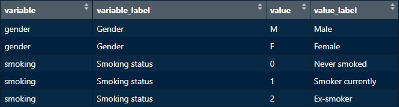

## Razón de ser

Although new pragmatic platforms (such as RedCap) currently exist, great deal of research data is still being collected directly in `excel`, where it is easier to code variables in a `short form`. For example, "birth date" is commonly coded in a `short form` as "dob" instead of "Date of birth", which is the `publication form`. The same applies to the `values` of variables, such as "F" and "M", which are both values for the "Gender" variable, and stand for "Female" and "Male", respectively.

Recoding variables and their values back to their publication form is an inevitable task during statistical analysis and reporting results.

The `recode_vrs()` function helps effortlessly transform collected data into a publication-ready format using a user-supplied `data dictionary`. Combining `recode_vrs()` with a `data dictionary` ensures `consistency` in recoding research terms across all analyses and publications as one could easily forget how a variable or a term was expressed in a previous analysis or publication. The recoded data can then be further used make figures, table one...etc.

## Terminología

In the above introduction, we have mentioned 4 terms:\
`variable`, such as "gender": this is the `short form` of a variable usually used un `excel` sheets.\
`variable label`, such as "Gender": this is the `publication form` that we usually encounter in summary tables.\
`value`, such as "F" and "M", which are both values for the "Gender" variable.\
`value label`, such as "Female" and "Male", which are the labels of the "Gender" values "F" and "M", respectively.

The inflammatory bowel disease (ibd) data dictionary provided in the `phdcocktail` package consists of 4 columns, one for each of the above-described terms.

```{r}
#| eval: false
library(phdcocktail)
data(ibd_data_dict, package = "phdcocktail")

View(ibd_data_dict)

```



All 4 columns are required in order for `recode_vrs()` to function as needed. Therefore, user-supplied data dictionaries **should** logically include the same columns!

## Uso

When passing a data frame with raw data and a data dictionary to `recode_vrs()`, the function will:\

1)  Search the data dictionary for `variables labels` ***for all variables***, and attach these to the corresponding variables in the original data frame as "label attributes". these attributes can be recognized by `gtsummary::tbl_summary()` or other functions for printing.\

2)  Search the data dictionary for `values labels` ***only for variables specified in the `vrs` argument***. These values will be "recoded" to their corresponding labels.

3)  If the `factor` argument is set to `TRUE`, variables specified in the `vrs` argument will be converted to `ordered factors`, and the order of the levels will be inherited from the order of appearance of the values in the data dictionary. These `ordered factors` are important to have the desired display of levels when passing the resulted data frame to functions from `ggplot2`, `gtsummary`...etc.

To see `recode_vrs()` in action, we will make table one from the `ibd_data1` available with the package:

Let's first view this data frame...

```{r}
#| eval: false
data(ibd_data1, package = "phdcocktail")

View(ibd_data1)

```


We can see that variables and their values are stored in a `short form`. We can make a table one using the data in its current form, but it won't be suitable to be published!

```{r}
#| eval: false
library(gtsummary)
theme_gtsummary_compact() # to make a compact table

ibd_data1 |>
  tbl_summary(include = -"patientid") # we don't need patient IDs in our table

```


Now let's recode this data frame using `recode_vrs()`, and view the new, recoded data frame, which we name here as `ibd_data_recoded`...

```{r}
#| eval: false
ibd_data_recoded <- recode_vrs(data = ibd_data1, data_dictionary = ibd_data_dict,
vrs = c("disease_location", "disease_behaviour", "gender"), factor = TRUE)

View(ibd_data_recoded)

```


We can notice two changes in the new data frame compared to the original one:\

1)  Variables labels are now attached as "attributes" underneath variables names *for all variables for which a corresponding variable label could be found in the supplied dictionary*.\

2)  Values have been **replaced** by their labels *for variables specified in the `vrs` argument*.\

3)  Variables specified in the `vrs` argument have been converted to `ordered factors`.

Finally, let's make table one from the new recoded data...

```{r}
#| eval: false
ibd_data_recoded |>
  tbl_summary(include = -"patientid")

```


## Some questions that might come to mind...

-   *Why not "recode" variables to their labels? who only attach these labels as "label attributes"?*\
    If we would recode variables names by their labels, then one would have to change the code in the subsequent steps in the analysis because variables names have changed! Since variable labels are only needed to print labels, attaching them only as "attributes" is a nice way to provide publishable names, but in the same time preserve original variable names.\

-   *Why not simply pass these variables labels directly to `gtsummary::tbl_summary()`?*\
    This would be tedious and a waste of time to do each time assuming that one is working with the same topic/disease. In addition, this is hugely prone to errors and inconsistencies across analyses and papers.\

-   *How is `recode_vrs()` different than `Hmisc::upData()`?*\
    In `Hmisc::upData()`, one would repetitively have to provide a list/vector with labels to the `label` argument, and this list/vector should be of the same length as the original data frame. In `recode_vrs()`, none of these conditions is required. `recode_vrs()` will automatically search for "whatever" variables labels it could find in the data dictionary. (attaching labels as attributes have no side effects or harm on other analyses steps! so why not simply gettin 'em all!)

-   *How is `recode_vrs()` different than `expss::apply_labels()`?*\
    In `expss::apply_labels()`, one would also need to pass the labels manually.
